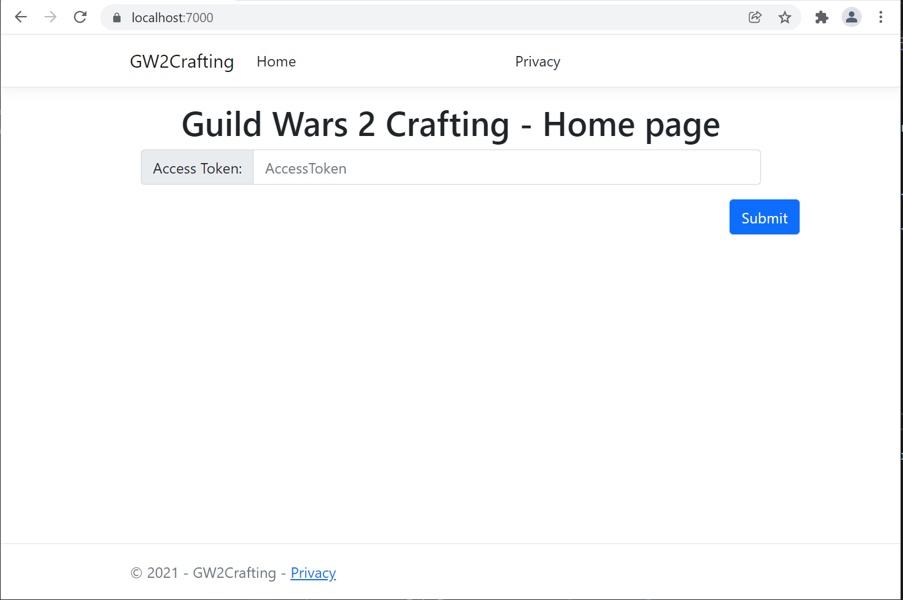
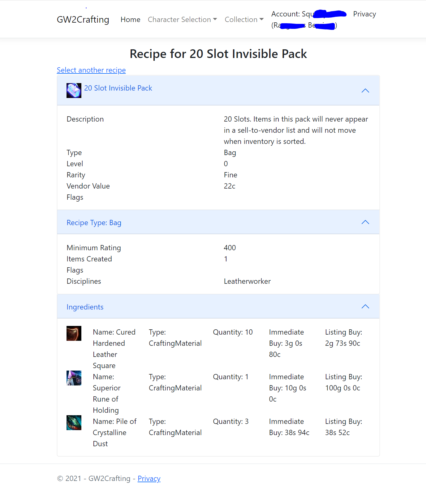

# Guild Wars 2 Crafting

## What is it?

It is a web app that can be used to look at an account and see inventory, bank, materials, known recipes and their current buying/selling prices if you want to craft it.

## Why yet another one?

1. I wanted something I can host at home so it had to be open source. I don't feel comfortable sharing my login with some random site on the Internet
2. Nobody had the feature set I was looking for
3. .NET 6 and Visual Studio 2022 just got released and I wanted to experiment with it

## Build environment

1. .NET 6 SDK
2. Windows or Linux. Should work on the Mac but I have not tested it
3. Optional: Visual Studio 2022 
4. Optional: Docker for Linux configured under Windows

To compile: `dotnet build`

To run: `dotnet run --project GW2Crafting`

On first run it may take a minute or two to start as it pre-caches some information from the Guild Wars 2 API.

It listens on https://localhost:7000 by default.

Docker support is still primitive as there is no SSL support.

## API Information

Wiki starting page for APIs : https://wiki.guildwars2.com/wiki/API:Main

## TODO

- [x] Build a database/cache of item details
	- https://wiki.guildwars2.com/wiki/API:1/item_details - id to structure - use LiteDb
	- Consider calling https://wiki.guildwars2.com/wiki/API:1/items to build all of them at startup if missing
- [x] Recipes - https://wiki.guildwars2.com/wiki/API:2/recipes
  - [X] Popup/new page to recipe
  - [X] Show price by either lowest selling price or highest buying price
- [x] Material storage - https://wiki.guildwars2.com/wiki/API:2/materials
- [x] Wallet - https://wiki.guildwars2.com/wiki/API:2/account/wallet
- [x] Unlocked recipes - https://wiki.guildwars2.com/wiki/API:2/account/recipes
- [x] Inventory - https://wiki.guildwars2.com/wiki/API:2/account/inventory
- [x] Bank - https://wiki.guildwars2.com/wiki/API:2/account/bank
- [x] Recipe details should show individual ingredient prices
- [x] Docker support
  - [ ] SSL Support for docker
- [ ] Recipe search - https://wiki.guildwars2.com/wiki/API:2/recipes/search
